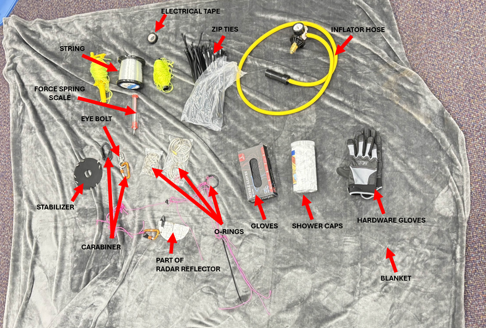

# General Ballooning Information

Access to ballooning is an integral part of any student space organization, providing cheap and reliable access to different environmental conditions across the Earth's Atmosphere. There are two ways to perform ballooning experiments: Unmanned Moored Balloons, which are limited by the FAA to be no greater than 500 feet, and Unmanned Free Balloons, which fly to the top of the Earth's atmosphere. This portion of the Wiki is meant to serve as a guide for new students within the Knights Satellite Club and other groups who want to get started in experimenting with ballooning.

## Definitions

Unmanned Moored Balloon - A balloon carrying a payload that is secured to the ground and flies at an altitude of less than 500 feet.

Unmanned Free Balloon (High Altitude Balloon -or- HAB) - A balloon carrying a payload that flies to the top of the atmosphere. Unmanned Free Balloons pop when the volume of gas in the balloon stretches the latex beyond its failure point.

Neck Lift - How much upward force a filled balloon has when measured at the neck of the balloon.

Lifting Gas - The gas that fills the balloon to produce lift. It should be either Hydrogen or Helium.

## Materials

Below is a list of reusable materials that you should have prior to any balloon flight:

* Picnic Blanket/Tarp
* Rubber Gloves
* Shower Hair Nets
* Hardware Gloves
* Balloon Inflator Hose
* Zip Ties
* Nylon String or Heavy Duty Fishing Line
* Electrical Tape
* Force Spring Scale
* 2-inch O-Rings (3D Printed or Metal)
* Carabiners (3D printed or Metal)
* Key Chain Rings
* 360 Swivel Eye Bolt
* Parachute
* Stabilizer (if a 2 payload setup is used)
* Radar Reflector

Below is a list of materials that will need to be replaced often:

* Balloon (Sized Correctly)
* Payload
* Lifting Gas

<figure><figcaption></figcaption></figure>

## Sizing Balloons

You need to choose the right balloon for what you are launching and where you are launching to. Unmanned Moored Balloons don't need a very large balloon since you are restricted to 500 feet off the ground.

First, you need to determine if you're launching a Moored Balloon or a Free Balloon. If you're launching a Moored Balloon, your Neck Lift, or how much upward lift your balloon has, doesn't need to be too large.

Second, you need to determine the weight of your payload. Launching on a Moored Balloon requires slightly more Neck Lift than what is required for buoyancy since the balloon doesn't need ot lift very fast.

Once these two things are determined, you can start playing with a launch calculator like Habhub to determine the balloon size and how much Lifting Gas you will need.
