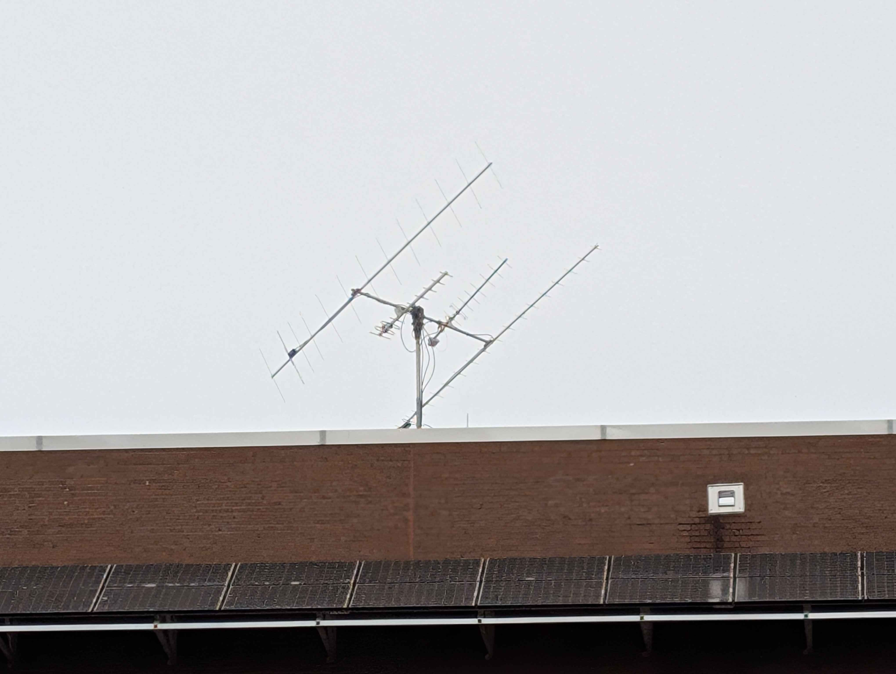

# Engineering Ground Station

## Overview

The [ground station](http://newton.i2lab.ucf.edu/wiki/Amateur_Satellite_tracking) ARC@UCF currently operates uses a Yaesu G-5500 rotator controller. This controller has a computer interface port which allows their GS-232B computer interface unit to automatically point the rotator at a target as instructed by a computer. The GS-232B is very expensive so many have implemented their own such as the [K3NG Controller](https://github.com/k3ng/k3ng_rotator_controller).

KSC is currently developing a custom computer interface unit to restore satellite tracking functionality to ARC's ground station. This open source interface is build around a Raspberry Pi Pico and will ultimately include firmware, a PCB, and enclosure.

This custom option was chosen to build experience with the Pico, train members on PCB design, and to have a simpler code base... most of the K3NG code resides in a single 22,000 line .ino file!

<figure><figcaption>
Ground station on ENG1.
</figcaption></figure>

## Custom Computer Interface

The G-5500 instruction manual briefly describes the external control interface. The DIN cable colors are specific to our cable breakout, I am not sure if they are standard.

<figure><figcaption>
G-5500 external control interface diagram from instruction manual.
</figcaption></figure>

<table><thead><tr><th width="63">Pin</th><th width="110">DIN Color</th><th>Function from Manual</th></tr></thead><tbody><tr><td>1</td><td>Brown</td><td>Provides 2 to 4.5 VDC corresponding to 0° to 180° (elevation)</td></tr><tr><td>2</td><td>Green</td><td>Connect to Pin 8 to rotate right (clockwise)</td></tr><tr><td>3</td><td>White</td><td>Connect to Pin 8 to rotate up</td></tr><tr><td>4</td><td>Blue</td><td>Connect to Pin 8 to rotate left (counterclockwise)</td></tr><tr><td>5</td><td>Yellow</td><td>Connect to Pin 8 to rotate down</td></tr><tr><td>6</td><td>Black</td><td>Provides 2 to 4.5 VDC corresponding to 0° to 450° (azimuth)</td></tr><tr><td>7</td><td>Red</td><td>Provides DC 13 V to 8 V at up to 100 mA</td></tr><tr><td>8</td><td>Gray</td><td>Common ground</td></tr></tbody></table>

### ADC Voltage Ranges

From our testing, we have found the azimuth voltage to vary from 0.22V (0°) to 4.23V (450°) and the elevation voltage to vary from 0.20V (0°) - 2.20V (90°).

### Motor Control Circuitry

We had hoped that switching pins on the Pico between low and high or input (low impedance) mode, we could create the active low control signals expected by the G-5500 without external circuitry. Initial testing was unsuccessful so a circuit utilizing an NPN transistor was tested but that also did not work.

The only difference between our test circuit and an example K3NG rotator diagram is a capacitor between the control line and ground just before the transistor. I am not sure why this would make a difference but it will be tested.

<figure><figcaption>
K3NG rotator circuit from the <a href="https://blog.radioartisan.com/arduino_rotator_controller/">Radio Artisan Blog</a>
</figcaption></figure>

## Useful Links

A collection of useful links relevant to this project.

* [Radio Artisan K3NG blog post](https://blog.radioartisan.com/arduino_rotator_controller/)
* [Ava K3NG hardware design](https://ava.upuaut.net/?p=372)
* [K3NG controller source and documentation](https://github.com/k3ng/k3ng_rotator_controller)
* [Yaesu G-5500 instruction manual](https://www.yaesu.com/downloadFile.cfm?FileID=8814\&FileCatID=155\&FileName=G-5500_IM_ENG_E12901004.pdf\&FileContentType=application%2Fpdf)

