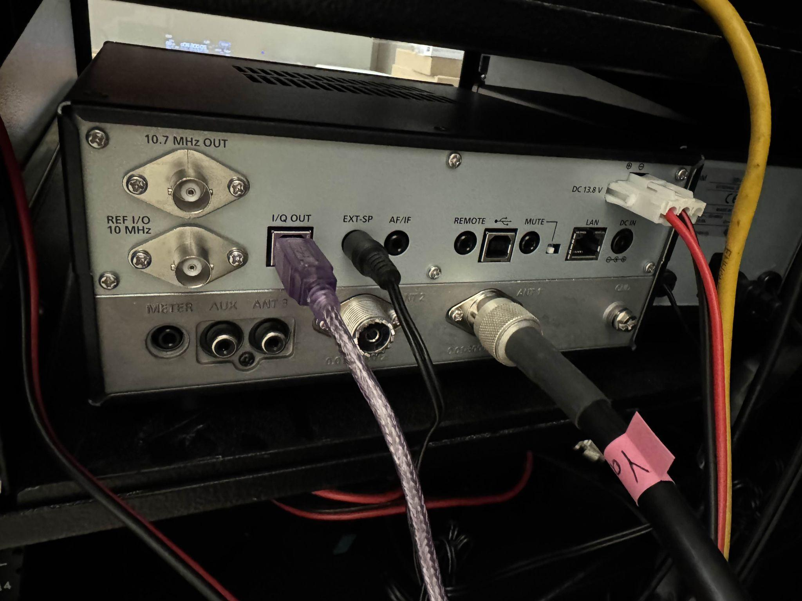
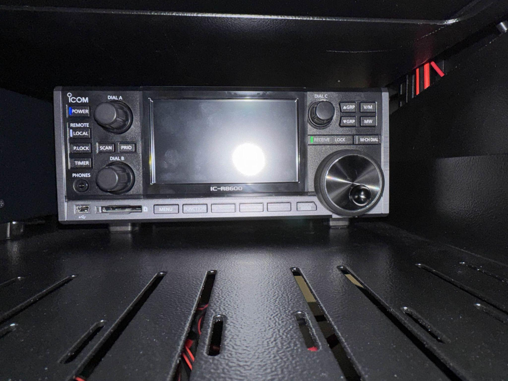
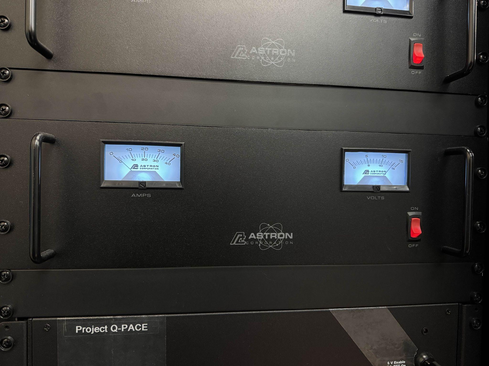
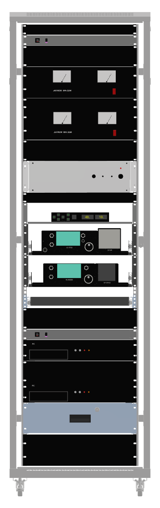

# Hardware

## Station location

The ground station antennas are mounted on the roof of the UCF Physical Sciences Building. The station equipment rack is located in the PSB lab space.

Roof work requires at least one person in the lab and one person on the roof, with active communication between both groups.

## Antennas

* Yagi antenna for the 70 cm band.
* Dish antenna for the 13 cm band.
* Future 2 m antenna support remains under consideration.

The Yagi antenna and dish antenna should be co-aligned straight outward with the rotator.

## Cabling

* The Yagi antenna uses N-type coax.
* The rotator has two motor-control wires.
* The rotator may also require a separate power wire; this still needs confirmation.
* The dish antenna cable type still needs confirmation.
* The cable distance from the lab to the ground station is approximately 100 ft.
* Coax attenuation may be a concern for the dish antenna frequency because of the long cable run.

## Radio equipment

* IC-R8600 software-defined radio.
* IC-9700 radio transceiver.

## Power equipment

The rack includes Astron power distribution units. There are two units, Use the Astron 1 and Astron 2 labels when identifying radio power paths.

## Rack layout

The rack layout image is shown below for quick reference. (will update this image with labels soon)

## Open hardware questions

These items still need confirmation:

* Confirm whether the rotator controller powers the rotator or whether there is a separate power cable.
* Confirm the specific rotator installed on the roof, including whether it is the 12 V or 18 V model.
* Confirm the dish antenna use case, cable type, and what equipment connects to it.
* Confirm cable specifications for the approximately 100 ft run.
