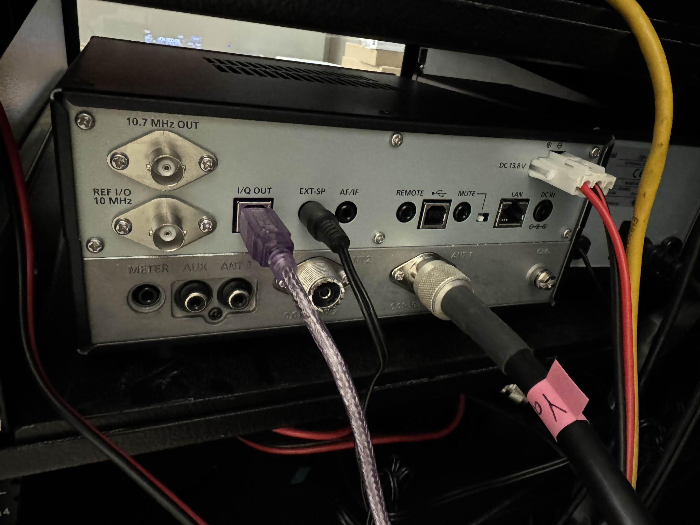
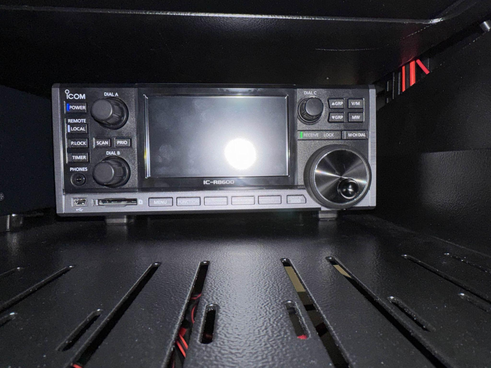
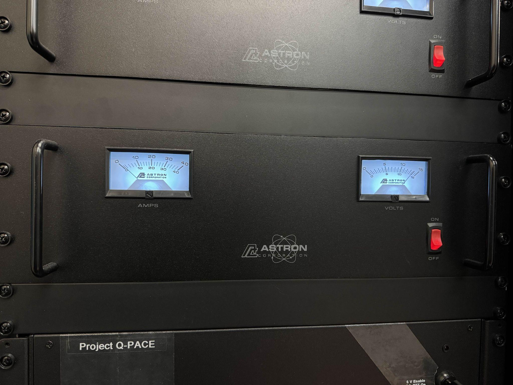
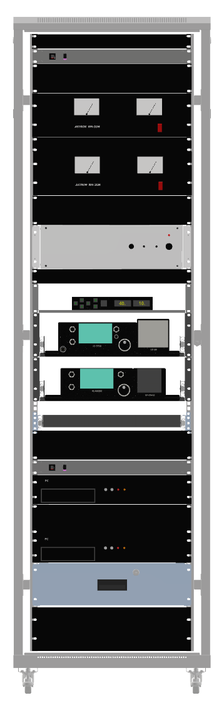

# Hardware

## Station

* Aluma T-24XXHD tower, currently documented at its lowest (nested) setting
* Rack: PDU, Astron 1 / Astron 2, IC-9700, IC-R8600, PC1-RF, PC2-Pointing, Big RAS controller


Aluma Tower T-24XXHD — shop drawings



Rack layout



Rack position — includes the airflow slide not in the PDF


## Antennas

* M2 2M7X — installed 2 m
* M2 425CP16 — installed 70 cm
* DSE1276LY — spare 12 cm loop yagi


M2 2M7X — manual



M2 425CP16 — manual



DSE1276LY — 12 cm loop yagi kit


## Pointing

* AlfaSpid BIG-RAS azimuth/elevation rotator
* ROT2Prog controller


BIG-RAS specifications



ROT2Prog controller manual



Standard rotator setup



Do not regulate


## Radios


IC-9700 — basic



IC-9700 — advanced



IC-9700 — CI-V



IC-R8600 — instruction



IC-R8600 — CI-V


## Station photos

