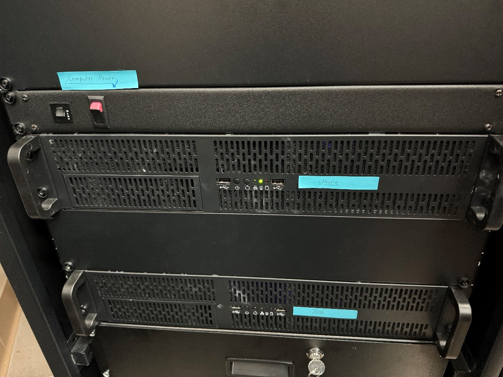
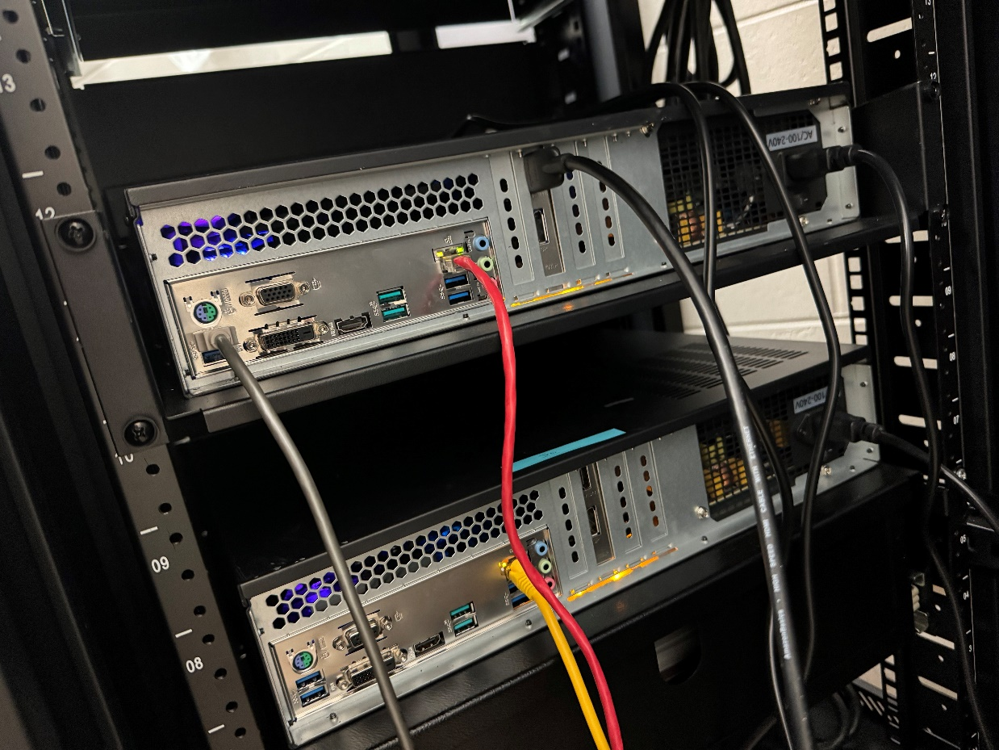
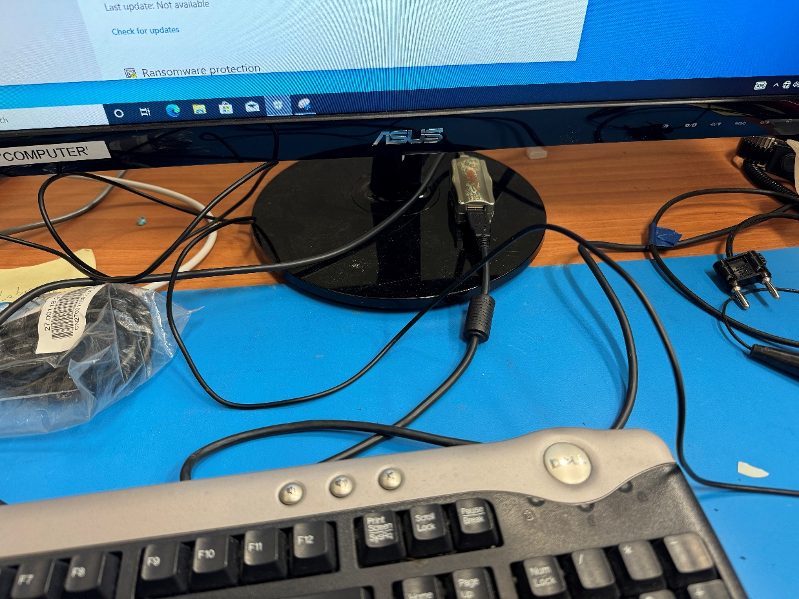

# Ground Station PC Setup

Use this procedure to bring up the ground station computers from the equipment rack.

## Setup procedure

1. Confirm the computers are receiving power from the PDU.
2. Confirm the PDU power switch is on. The red switch position is the on state.
3. Connect the HDMI cable to a monitor.
4. Connect the keyboard to the other end of the USB extension cable.
5. Plug the mouse into the keyboard USB port.
6. Press the computer power button.
7. Confirm the monitor receives signal from the computer.

## Troubleshooting

### Computer is on but the monitor has no signal

If the computer has been left on for a long time, it may enter a deep sleep state. Hold the computer power button until the light turns off, then press it again to power the computer back on.

If restarting from the front power button does not restore video, power the computer down again and toggle the power supply switch at the rear of the computer off and back on.

Also confirm:

* The monitor is powered on.
* The monitor input source is correct.
* HDMI is connected to the monitor.
* The USB extension and keyboard are connected.
