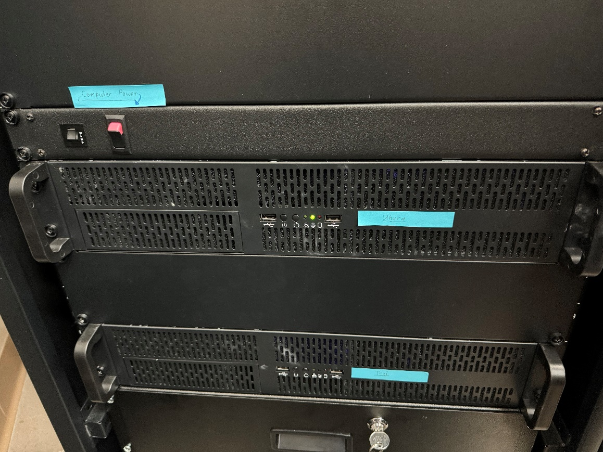
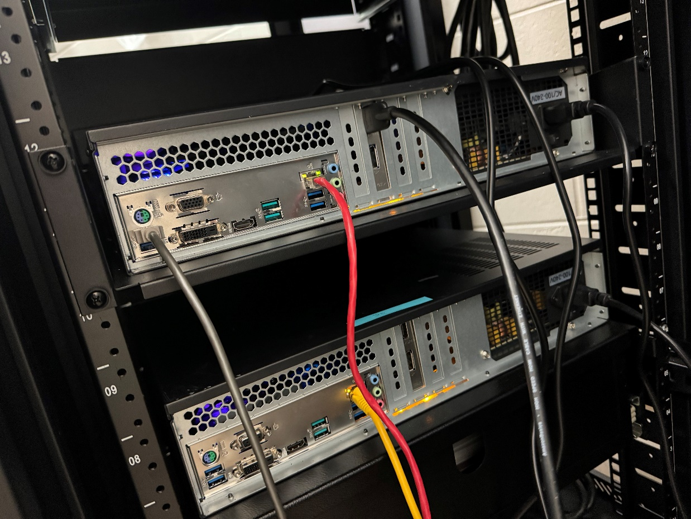
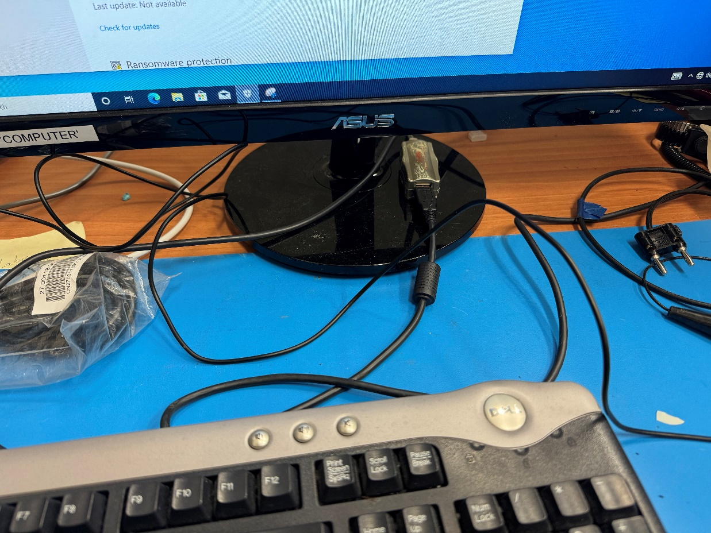

# Connect a computer


**These steps still need to be checked at the station.** There is no recorded test date.


1. Check that the power distribution unit (PDU) above the computers is on. The red switch position means on.
2. Connect the labeled HDMI and USB extension cables to the computer you want to use.
3. Connect HDMI to the monitor. Connect the keyboard to the other end of the USB extension.
4. Plug the mouse into the keyboard USB port.
5. Press the computer power button on the rack front.
6. Check that the computer screen appears on the monitor.

## No display signal

If the computer has been on a long time it can enter a deep sleep. Hold the power button until the light goes off, then press it again.

If that fails, shut the computer down and flip the power-supply switch on the back off and on. Check that the monitor is on, its input matches the HDMI port you used, and the HDMI cable is plugged in firmly.


PC Connection Guide — setup photos



PC Setup Instructions — original write-up


## Setup photos

