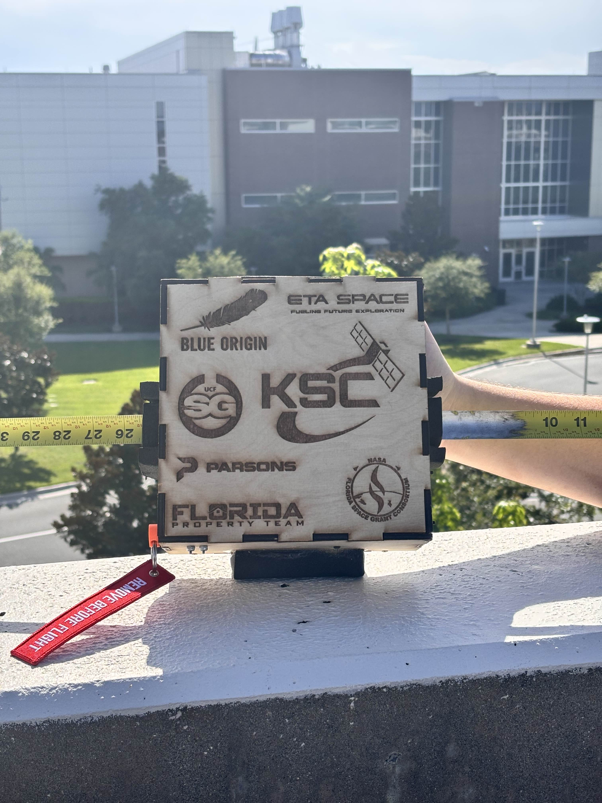
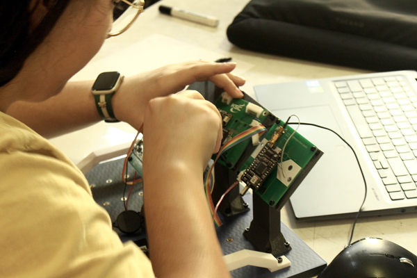

# KAOS-1

## Project Overview&#x20;

KAOS-1 Is an high-altitude balloon mission designed to validate core subsystems and operational workflows that directly support future orbital CubeSat missions.

<figure><figcaption>
KAOS-1 flight hardware conducting a communications test
</figcaption></figure>

The primary objective of KAOS-1 is to collect atmospheric telemetry (temperature, pressure, GPS, orientation, CO2, humidity, etc.) at stratospheric altitudes and demonstrate end to end communication, power management, and recovery processes. Pushing systems into the near space environment, we reduce risks for subsequent orbital platforms developed by the Knights Satellite Club.

<figure><figcaption>
KAOS-1 flatsat configuration
</figcaption></figure>

\
This project also serves as hands on training for club members, providing experience in systems integration, flight hardware assembly, telemetry analysis, and regulatory compliance. It's intentionally architected to reflect future satellite constraints to ensure maximum reuse of hardware and software when needed for future missions.

<figure><figcaption>
Electrical member soldering flight hardware
</figcaption></figure>
