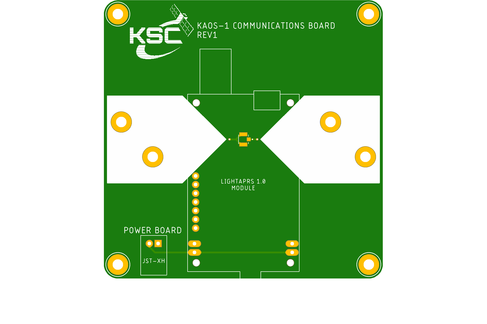
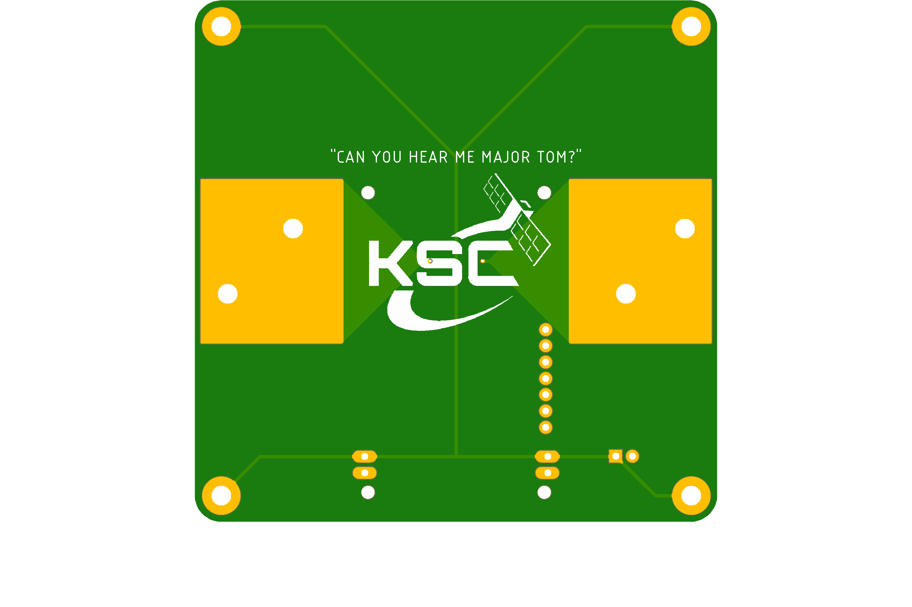

# Electronics

## Overview

<figure><figcaption>
Assembled KAOS-1 electronics stack.
</figcaption></figure>

KAOS-1 uses a stack of 4 simple PCBs. Each PCB has 2-layers and is designed for breakout boards to be soldered on. This results in poor utilization of PCB real estate necessitating the 4-board design, but makes the individual boards much easier to develop and test. All boards except for Communications have a ground pour on both layers.

The boards from top to bottom are Power, Sensor, Primary, and Communications. Each board is 8cm x 8cm with a 4mm filet on the corners. Each corner has a plated M3 hole centered 4mm from either edge. The boards connect to one another through JST-XH connectors placed on the edge of each board. The connectors are designed to line up vertically when stacked for simple cable management. The boards are stacked using M3 standoffs and loaded into a sled that slides into the 4U enclosure.

The boards were designed in Autodesk EAGLE which worked well and was relatively easy to learn. All design files are available [on GitHub](https://github.com/UCF-Knights-Satellite-Club/KAOS-1/tree/main/flight/electronics). Future projects will likely use KiCAD because of the larger feature set, active development, and open ecosystem.

## Power Board

<figure><figcaption>
Render of Power Board top layer.
</figcaption></figure> <figure><figcaption>
Render of Power Board bottom layer.
</figcaption></figure>

<figure><figcaption>
Schematic for Power Board.
</figcaption></figure>

The Power Board holds 2 18650 lithium batteries, a 3.3V linear regulator, and connectors for other boards and the Remove Before Flight (RBF) switch. The RBF switch is a normally-closed limit switch that disconnects the batteries from the rest of the system when a pin is inserted.

### Battery Chemistries

We have tested 18650 cells with Li-ion and LiFePO4 chemistries. LiFePO4 have lower voltage and power density but are reported to handle the low temperatures of high altitude balloon flights better. LiFePO4 batteries also pose a lower fire hazard which is ideal since we may not recover the payload. KAOS-1 is planned to fly with LiFePO4 batteries but more testing needs to be done.

### Errata

It was incorrectly assumed that the heat sink of the linear regulator should be connected to ground. It is actually connected to the 3.3V output so insulating tape must applied to prevent the heat sink from contacting the exposed pad under the regulator.

## Sensor Board

<figure><figcaption>
Render of Sensor Board top layer.
</figcaption></figure> <figure><figcaption>
Render of Sensor Board bottom layer.
</figcaption></figure>

<figure><figcaption>
Schematic for Sensor Board.
</figcaption></figure>

The sensor board holds a BMP388 barometric altimeter, an SCD-30 CO2 and humidity sensor, a GY-521 MPU6050 6-axis IMU, and a connector for a 10k thermistor. There is also a 10kΩ resistor which is needed to read the thermistor. This board is responsible for taking atmospheric measurements during the flight.

The most useful readings to meteorologists are pressure, temperature, and humidity. Agencies such as NOAA regularly fly [radiosondes](https://www.noaa.gov/jetstream/upperair/radiosondes) which measure this information.

### Errata

The 3-pin power connector has ground and 3.3V switched. The workaround for this is to switch these conductors on the cable assembly.

The SCD-30 pinout is backwards. For the sensor to work, the original headers needed to be removed and installed coming from the front of the sensor. The sensor is then installed face down on the Sensor Board.

## Primary Board

<figure><figcaption>
Render of Primary Board top layer.
</figcaption></figure> <figure><figcaption>
Render of Primary Board bottom layer.
</figcaption></figure>

<figure><figcaption>
Schematic for Primary Board.
</figcaption></figure>

The Primary Board holds the ESP32 microcontroller, a MicroSD reader, a PCF8523 real time clock, connectors for two ArduCam Mega cameras, and a connector for a piezoelectric buzzer.

Both ArduCams share the VSPI bus, and the MicroSD card uses the HSPI bus. Both busses are implemented in hardware on the ESP32. All other peripherals communicate over I2C. Several GPIO pins go to the sensor board for interrupts and analog readings. There is also a resistor divider to measure the unregulated battery voltage.

### Errata

The HSPI bus is used by the ESP32 during boot. If the SD card has been initialized and there is a reset, the ESP32 may crash with invalid header messages. More research and testing is needed on this.

## Communications Board

<figure><figcaption>
Render of Communications Board top layer.
</figcaption></figure> <figure><figcaption>
Render of Communications Board bottom layer.
</figcaption></figure>

<figure><figcaption>
Schematic for Communications Board.
</figcaption></figure>

The Communications Board holds a [LightAPRS](https://qrp-labs.com/lightaprs.html) radio and exposed pads for the tape measurer antenna. There is no ground plane on this board due to uncertainties about how a ground plane would interact with the antenna.

The LightAPRS only receives power from the Communications Board and contains an integrated controller, sensors, and GPS receiver. When powered up, the LightAPRS automatically transmits telemetry information to the [APRS network](https://www.aprs.org/). The radio signal from the LightAPRS is carried to the board over a coax cable that connects to a surface mount U.FL connector.

### Errata

The power regulator on our LightAPRS board stopped working. In order to power it, we have to connect its 3.3V output pin to our 3.3V regulator. This limits our transmit power from 1W to 0.5W but for balloon flights this is not a problem. Replacing or fixing the LightAPRS should fix this issue without any changes on the PCB design.

