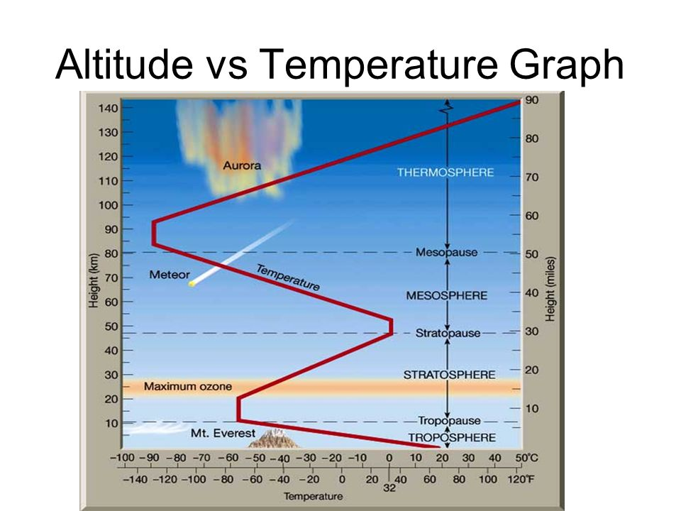

# Hardware

## Overview

\
Following the foot steps of our previous projects our mechanical team utilized [Onshape's](https://www.onshape.com/en/education/plans) educational license as our CAD platform. From a hardware perspective we had two main focuses on KAOS-1; [Electronic Integration](hardware.md#electronic-integration) and [Payload Temperature Testing](hardware.md#payload-temperature-testing). Both were the central focuses when it came to establishing our design and iterating to our eventual flight hardware. All of our CAD for KAOS-1 can be viewed and exported [on Onshape](https://cad.onshape.com/documents/d8ec8b69a1bae0e7a9f94029/w/ac2041561a361db9fbc85842/e/0252f4e742c3d5c2741b99e8?renderMode=0\&uiState=69545cd807123b77856fa423).

The first observable difference between KAOS-1 and the majority of CubeSats or HAB payloads would be the wood housing we are using. This design decision took some inspiration from the [WISA Woodsat](https://www.wisaplywood.com/wisawoodsat/) and [Lignosat from JAXA](https://www.nasa.gov/image-article/jaxas-first-wooden-satellite-deploys-from-space-station/) when we first started developing the project in Fall 22'. This design decision brought many advantages and many unexplored challenges.&#x20;

Wood gave the team a high level of flexibility when it came to integrating or iterating our design. Being able to drill and bolt in new hardware to a prototype payload bus to test a variety of components such as a new GPS patch antenna. Making on the spot changes was incredibly helpful and made things a lot easier for our mechanical team. All while spending about $3 per payload bus and 30 minutes of assembly. More can be read on the payload bus and the wood we used under the section [Payload Bus](hardware.md#payload-bus).

The challenges came from concern on woods ability to withstand drastic temperature and humidity changes during the span of the flight without cracking. Without access to standard testing equipment such as a thermal vacuum chamber we were left to create a budget thermal test that can be seen [here](hardware.md#sub-zero-temperature-conditions).&#x20;

## Electronic Integration

A key requirement for any mechanical team working on a CubeSat project is integrating electrical systems. For our team that included incorporating four [PCB's](electronics.md), two ArduCam Mega cameras, sensors, and a remove before flight pin switch.&#x20;

<figure><figcaption>
KAOS-1 in flatsat configuration
</figcaption></figure>

The flatsat configuration was important for our mechanical team to pull dimensions and be able begin the design process for integrating electronics. Our main requirements were accessibility to the main components like our batteries, cameras, and the micro-usb header on the ESP32 microcontroller for software changes. Keeping this as the focus of our design means that testing and launch day operations can run much smoother and quicker.

### PCB Sled

The four custom PCB's our electrical team designed needed a way to house the stack inside the payload bus. For this, we designed two main components that would allow us to have a rigid mounting  solution while being able to easily remove the stack and let the electrical or software teams work with the boards. The PCB sled seen below has a rail component that mounts to one of the side walls of the bus and another component that slides onto the rail and can be locked in place via a single pin at the top of the rail.

<figure><figcaption>
Assembly of our PCB Sled
</figcaption></figure>

The stack bolted straight onto the sled and allowed us to still have access to the batteries through the top cutout and the ESP32 header through one of the open sides. These features were useful on launch day when it came time to do final checks, as seen below.

<figure><figcaption>
PCB sled being lowered into payload bus
</figcaption></figure> <figure><figcaption>
Software checks while the PCB's are stacked in sled on launch day
</figcaption></figure>

### Cameras

Two Arducam Mega variants were used on KAOS-1. Both of the cameras being 5MP with one having a [M12 lens](https://www.arducam.com/mega-5mp-color-rolling-shutter-camera-module-with-m12-lens-for-any-microcontroller.html) and the other [without a lens](https://www.arducam.com/presale-mega-5mp-color-rolling-shutter-camera-module-with-autofocus-lens-for-any-microcontroller.html). With the lofted front of the M12 lens variant we had two versions of the camera mounts. The lens variant required a few millimeters to be added to accommodate the extra thickness of the camera.&#x20;

<figure><figcaption>
KAOS-1 assembly where both camera mounts can be seen. One pointing downward and the other to the side
</figcaption></figure>

For simplicity and ease of access the camera mounts were two 3D printed components. They were secured with 30mm M3 bolts that went through the mount and to the outside of the bus where a nut was attached to each bolt.

<figure><figcaption>
Front view of one of the camera mounts
</figcaption></figure>

### Payload Bus

The payload bus was made from [low cost 1/4" plywood](https://www.homedepot.com/pep/ProWood-1-4-in-x-2-ft-x-2-ft-Sanded-Plywood-Project-Panel-109114/202093828?source=shoppingads\&locale=en-US\&fp=ggl\&pla=\&mtc=SHOPPING-BF-CDP-GGL-D21-021_001_PLYWOOD-NA-NA-NA-PLALIA-NA-NA-NA-NA-NBR-NA-NA-NEW-_PLATEST\&cm_mmc=SHOPPING-BF-CDP-GGL-D21-021_001_PLYWOOD-NA-NA-NA-PLALIA-NA-NA-NA-NA-NBR-NA-NA-NEW-_PLATEST-22114087436-173523647899-299067764094\&gclsrc=aw.ds\&gad_source=1\&gad_campaignid=22114087436\&gbraid=0AAAAADq61UdHIveq5AaMwaO9c9T-e8Y2p\&gclid=CjwKCAiA09jKBhB9EiwAgB8l-A4FfXVglP7iFutXKTjvUEvz7ryOFop-Jm72HLghL8hV5Nxa29wLBBoCP0MQAvD_BwE#overlay) and laser cut for free in UCF's engineering center. We tried a few methods for assembling the bus but the best method we found was [M2 wood screws](https://www.amazon.com/dp/B0C5JVC6Z3?ref_=ppx_hzsearch_conn_dt_b_fed_asin_title_3). Alternatively we tried to pre drill the holes and use M3 bolts, however, this was time consuming and with the thinness of the wood, very easy to crack or pierce the side of the bus.

<figure><figcaption>
Payload bus assembly 
</figcaption></figure>

Every aspect of the bus in the assembly was able to be laser cut including M3 through holes and engraving our sponsors on the top panel. Overall, wood was a phenomenal material to use for a HAB launch. Each prototype was inexpensive, easily manufactured in as little as 30 minutes, and survived the atmospheric conditions without any signs of defects. It allowed us to make changes quicker than 3D printing our payload buses, as we usually do.&#x20;

## Payload Temperature Testing

A key focus for us using a wood housing for a HAB launch was to ensure that our bus could survive extreme changes in temperature and humidity without major cracks forming. As seen in the altitude vs. temperature graph below we knew that we could expect temps from 80 degrees Fahrenheit on the ground and -70 degrees Fahrenheit for a majority of the flight. We were worried about this cold and dry air causing the wood to contract and crack as it was restricted by the wood screws. As a result we conducted the best [testing](hardware.md#sub-zero-temperature-conditions) we could with the resources we had access to.

<figure><figcaption>
Approximate altitude vs. temperature relation
</figcaption></figure>

### Sub Zero Temperature Conditions

The best form of testing we could conduct involved a large styrofoam cooler and a few pounds of dry ice. We placed two [thermometer probes](https://www.amazon.com/dp/B0C4YL76WY?ref_=ppx_hzsearch_conn_dt_b_fed_asin_title_1\&th=1) in the cooler, one inside of the payload and another on top to record the temperature of the air inside the cooler. In this test we were able to record air temperatures as low as -55 degrees Fahrenheit and tested our electronics and batteries down to -22 degrees Fahrenheit. Although we weren't quite able to reach the exact temperatures we expected to see during flight, we were still able to test under extremely cold conditions for two hours and all systems performed flawlessly.

<figure><figcaption>
Dry ice testing setup
</figcaption></figure>

Outside of the wood withstanding the temperatures we were also concerned about our electronics getting too cold. To combat this we insulated the bus and added hand warmers to help with internal temperatures. In the graph below it's visible that these efforts certainly helped us maintain safe operating temperatures for our electronics. Although the hand warmers weren't very impactful in this test due to the CO2 omitted by the dry ice. We still proceeded with them for launch in order to keep our internal temperature a bit higher than what was reached an hour into testing. As well as above zero in flight conditions. The use of hand warmers being untested ended up being a problem for us on flight day which can be read more in [post flight results](post-flight-results.md#lessons-learned).

<figure><figcaption>
Temperature vs. Time for inside payload bus and the exterior testing environment
</figcaption></figure>
