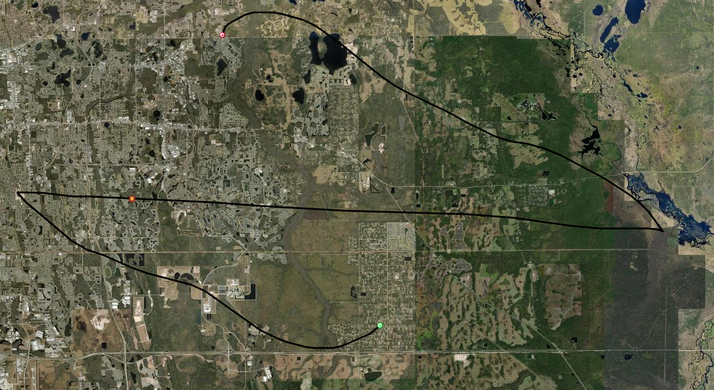

# Launch Day

## Before Launch Day

In the week leading up to the scheduled launch day, Nathan, the KAOS-1 Project Lead, ran the flight prediction software every day to find a good launch site. Habhub takes the Latitude/Longitude of launch sites, the Launch Altitude (in meters), Launch Time (UTC), Launch Date, Ascent Rate (m/s), Balloon Burst Height (meters), and Descent Rate (m/s) as inputs and outputs a predicted flight path.

The Knights Satellite Club was looking at a few possible launch locations two days before launch: Econ River Wilderness Area, Sunrise Community Park, Sanlando Park, and the Oviedo Sports Complex.

<figure><figcaption></figcaption></figure>

Figure 1: Launch Trajectory From Econ River Wilderness Area (28.6134, -81.1742)

<figure><figcaption></figcaption></figure>


Figure 2: Launch Trajectory From Sunrise Community Park (28.6523, -81.2585)

<figure><figcaption></figcaption></figure>

Figure 3: Launch Trajectory From Sanlando Park (28.6759, -81.3964)

<figure><figcaption></figcaption></figure>

Figure 4: Launch Trajectory From Oveido Sports Complex (28.6692, -81.1872)

On August 29th, 2025, the Econ River Wilderness Area was chosen as the best-suited launch site as the payload was predicted to land in Wedgefield, Florida, approximately 2 hours after launch. The FAA was also notified of this launch.



<figure><figcaption></figcaption></figure>



<figure><figcaption></figcaption></figure>



***

## Launch Day

The morning on August 30th, 2025, the Knights Satellite Club drove out to the Econ River Wilderness Area at 8 am and began setting up. To learn more about inflating and rigging a balloon for flight, please visit the [High Altitude Free Balloons](../../../ballooning/high-altitude-free-balloons.md) page.

### Payload Preparation

### Balloon Launch!

After preparing the payload, the balloon train was constructed. A 5-foot line of string connected the top of the parachute and the Balloon together, then a 360-degree swivel eyebolt was attached to the bottom of the parachute to prevent the balloon train from winding up and popping the balloon. Below the parachute was another 10 feet of string before attaching to the payload.

At approximately 10:07 am EDT, the balloon was released, and KAOS-1 took flight.
