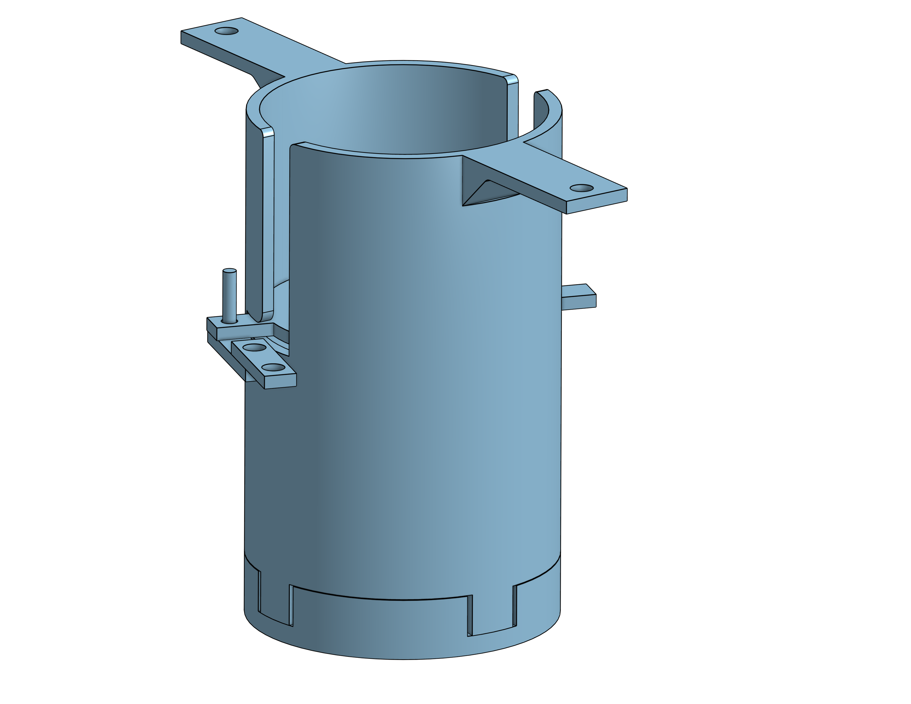

# T-Sat-0

Tethered-Sat (T-Sat) is an ongoing balloon project within the Knights Satellite Club initially beginning in Fall 2023 as a beginner-friendly, rapidly developed platform for hands-on learning and experimentation. The project was created to give new members an accessible entry point into satellite systems, reducing the intimidation factor of jumping straight into a full orbital CubeSat development cycle.

By utilizing a tethered balloon as a launch platform, T-Sat offers an opportunity for students to engage with the full lifecycle of a CubeSat mission. From design and prototyping, to subsystem integration, testing, and launch all within the span of a single semester. This quick turnaround allows new members to see their contributions materialize in real time, creating a sense of accomplishment early in their involvement.\
\

<figure><figcaption>
Tethered-Sat 0 Flight Profile
</figcaption></figure>

Beyond being a training ground, Tethered-Sat also serves as a technical pipeline for the club. More experienced members are encouraged to take on subsystem leadership roles within T-Sat, developing their skills in team management and system integration before transitioning to larger, more complex club projects such as KAOS or our long term orbital CubeSat mission. This progression pathway supports both technical growth and leadership development across all experience levels.

Additionally, T-Sat plays a vital role in the club’s research and development strategy. The platform is used to test experimental payloads, validate subsystems, and prototype new technologies before they are integrated into orbital missions. This makes Tethered-Sat not only an educational tool, but also a key component of the club’s iterative design philosophy and mission readiness pipeline.\
\
Tethered-Sat-0 (T-Sat-0) was the Knights Satellite Club's first iteration of the greater T-Sat Project. From Project Fruition to launch took a little over 3 semesters to complete. Moving forward T-Sat versions will follow a more rapid turnaround period to launch within a single semester or two depending on the demands of the experiment. With the structure, documentation, and launch operations developed during T-Sat-0 this goal will be attainable during future versions.

## Mechanical&#x20;

#### Mechanical Development of T-Sat-0

The mechanical team in the Knights Satellite Club faced the challenge of developing a deployable parachute mechanism for the T-Sat-0 mission, with the primary objective of ensuring a safe payload recovery post release from the burn wire. This endeavor was pivotal and fully centered on mechanical design and rigorous testing.

**Initial Research and Decision**

During the initial research phase, the team evaluated various deployment methods for the parachute system. Ultimately, it was determined that a spring deployment mechanism would offer greater simplicity and ease of integration within a 1U CubeSat, compared to a more complex pneumatic system.

**Design, Prototyping, and Testing**

The team embarked on designing the parachute deployment system (PDS), opting for an open-top canister design equipped with a spring-activated platform. This design aimed to facilitate efficient deployment while maintaining a minimal footprint. Multiple iterations of the PDS were created using 3D printing manufacturing, allowing the team to refine the design, reduce complexity, and enhance functionality. It was tested extensively through drop tests at a four story parking garage on campus. After a couple of failed deployments, and as a result broken parts, the team started using a large tablecloth held by two members to catch T-Sat to prevent damage during testing. This helped greatly and reduced the downtime between tests because of broken panels or parts that needed to be replaced with spare components.\

<figure><figcaption>
Final CAD assembly of T-Sat-0 PDS
</figcaption></figure>

**Finalization**

Through continuous testing and improvement, the final design of the PDS emerged effectively balancing size constraints with operational reliability, thereby achieving the desired outcomes for the T-Sat-0 project.

<figure><figcaption>
Flight ready  T-Sat-0 
</figcaption></figure>

## Avionics

## Software

