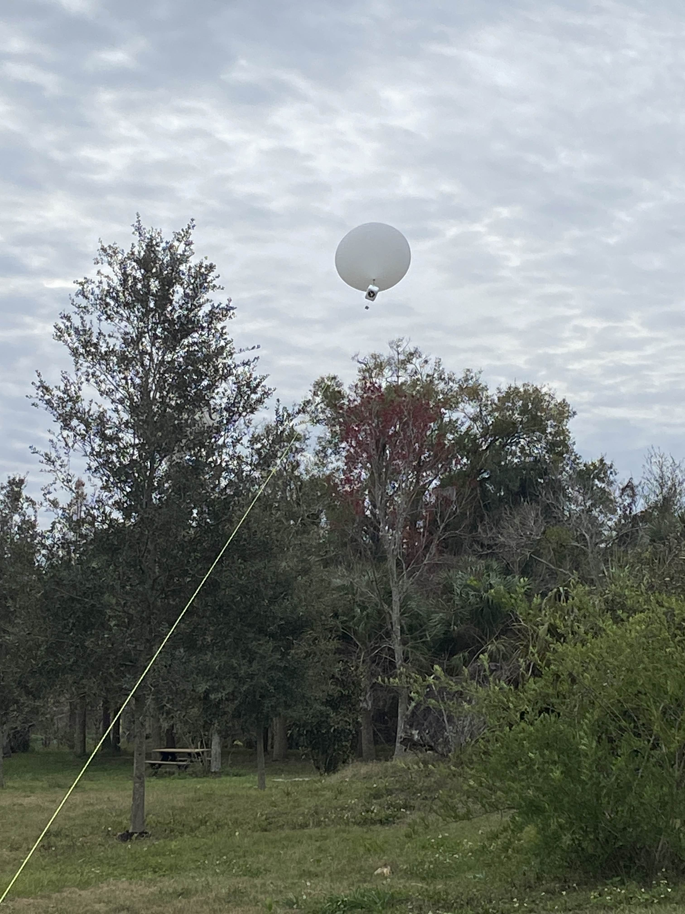
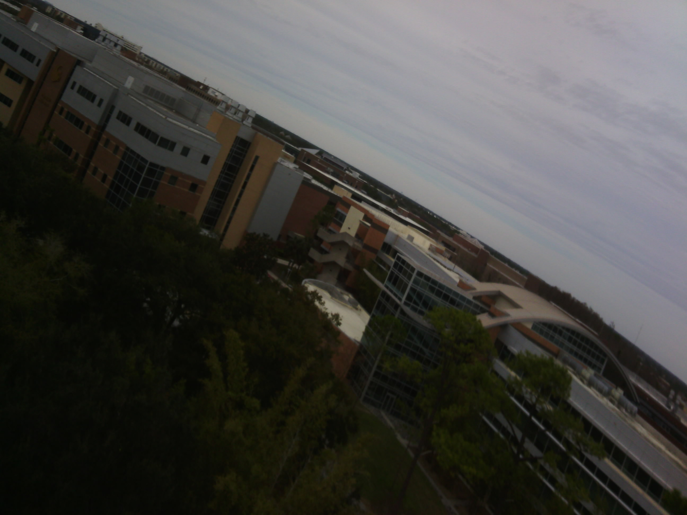

# Flight Results

## Overview

T-Sat-0 took flight from the UCF Arboretum on the morning of January 20th, 2025. The same balloon was used for two flights. The parachute deployed early on both flights, and the burn wire detachment system was used successfully on the second flight.

## Flight 1

The first flight carried T-Sat-0 and MEDUSA, a Muon detection experiment from the UCF Astronomy Society.

<figure><figcaption>
Altitude graph for flight 1 of T-Sat-0. Measured in m.
</figcaption></figure>

The mass of both payloads and rigging hardware was around 1300g and close to the limit of what our balloon could lift. Due to this, wind caused the payloads to get pulled sideways and down faster than the balloon could lift them up. This flight lasted around 3 minutes reached an altitude of 34m (111ft) before high winds caused T-Sat-0 to hit a tree and break free from the balloon.

<figure><figcaption>
Acceleration graph for flight 1 of T-Sat-0. Measured in m/s/s.
</figcaption></figure>

T-Sat-0 was programmed to only deploy it's parachute after it began falling. One way of detecting free fall was to check when the onboard accelerometer read close to zero. The threshold was set to 2m/s/s which was hit several times during the flight causing the parachute to deploy early. We believe the accelerometer readings were caused by the high wind and manually releasing the tether inconsistently.

<figure><figcaption>
Ascent velocity graph for flight 1 of T-Sat-0. Measured in m/s.
</figcaption></figure>

The second way of detecting free fall was to monitor the rate of change in altitude measured by the onboard barometric altimeter. The threshold was -5m/s which was not reached during this flight. The parachute only needed one trigger to deploy so the ascent velocity data was effectively ignored.

<figure><figcaption>
Temperature graph for flight 1 of T-Sat-0. Measured in °C.
</figcaption></figure>

T-Sat-0 also records the temperature during flight. There was not much variation during this flight, but the higher temperature before and and after landing could be caused by handling of the payload.

<figure><figcaption>
T-Sat-0 flight 1 being pulled into trees by wind.
</figcaption></figure>

<figure><figcaption>
Picture taken by T-Sat-0 during flight 1.
</figcaption></figure>

## Flight 2

Once the balloon was reeled in, MEDUSA and some rigging hardware was removed. The new payload mass was around 500g. The same balloon was used so the lift to mass ratio was much higher than before.

<figure><figcaption>
Altitude graph for flight 2 of T-Sat-0. Measured in m.
</figcaption></figure>

This flight overcame the winds and achieved a max altitude of 119m (390ft) before the burn wire was remotely triggered and T-Sat-0 detached from the balloon. Unfortunately, the payload drifted to a paved area and was destroyed when it hit a concrete loading dock.

<figure><figcaption>
Acceleration graph for flight 2 of T-Sat-0. Measured in m/s/s.
</figcaption></figure>

Again, rough conditions and inconsistent tether release caused the accelerometer reading to go below threshold and activate the parachute. The early deployment caused the excessive drift which led to the destruction of the payload.

<figure><figcaption>
Ascent velocity graph for flight 2 of T-Sat-0. Measured in m/s.
</figcaption></figure>

The ascent velocity dipped below the -5m/s threshold only after the burn wire had triggered. Based on this, we can conclude that had we only relied on the velocity data the parachute deployment would have likely worked correctly. This graph shows that T-Sat-0 was falling at 6m/s after the parachute deployed.

<figure><figcaption>
Temperature graph for flight 2 of T-Sat-0. Measured in °C.
</figcaption></figure>

For this flight, the temperature clearly follows the altitude. Contrary to expectations, the temperature rose with altitude. This may be due to ground absorbing heat after the cold night.

## Lessons Learned

This was the first balloon flight from KSC. Lots of things went wrong but it was overall very successful. Here is what we want to improve on:

### Mechanical

* Build 3 models - one for the Mechanical Team, one for the Avionics Team, and one for flight.
* Invest in tools and equipment to build and test prototypes.
* Order backup components to test, allow for faster development, and allow for quick recovery after losing or breaking components just before launch.
* All future 3D printed housings should be using heat-press threaded inserts rather than the difficult to work with nut inserts.
* Never use bolts as linkage pivot points.
* No more press fit back panels, all should be bolted or otherwise secured.

### Avionics

* When utilizing servos, supply a minimum of 4.8V.
* Use a less sensitive or different style of power/RBF switch.
  * Invest in aerospace grade switches (definitely not overkill).
* Place accelerometers in the middle of PCB to prevent centrifugal forces creating very messy data for free fall detection.
* Investigate better algorithms and filtering for more reliable free fall detection.
* Investigate new camera with faster image processing (ArduCam Mega limited to 20+ sec per image).
* Integrate components onto PCB rather than using breakout boards.
  * Invest in programmer and debugger.
* Develop real-time Tx/Rx capabilities with payload for better debugging before and during flight.
  * Implement real satcom capabilities for transmitting commands such as force reboot.
  * Develop proper ground station (maybe future project for mobile, general purpose ground station: SBC + antenna mount + SDR transceiver).
* Investigate storing flight-critical data in persistent memory since if T-Sat-0 rebooted in-flight it would lose its ground calibration.
* Invest in proper battery charging bays that can charge multiple batteries at once.
* PCB design changes
  * Connector for RBF switch to make it chassis mounted (not directly mounted to PCB).
  * Better chassis mounting method (ground plane reinforced screw mounts on PCB). Metal standoff screws with Loctite or something more robust than nylon screws.

### Operations

* Monitor wind conditions and prioritize for go/no go decision.
* Mass and gas calculations need to be completed ahead of time.
* Invest in physical force scale (physics weights).
* Invest in hardware gloves.
* Better way for releasing (and retracting) tether line consistently.
* Do not underestimate the length of approval process for campus flights. Start early!
* Set up payloads inside initially.

