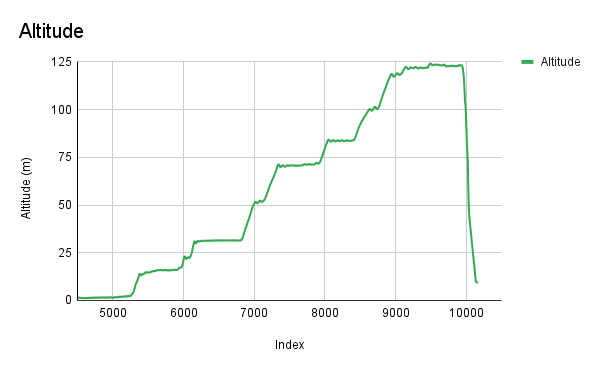

# Flight Results

## Overview

T-Sat-1 took flight from the UCF Arboretum on the morning of June 21st, 2025. The burnwire mechanism worked correctly allowing the parachute to deploy successfully and at the correct altitude.

## Flight 1

The flight of T-Sat-1 began around 9:30 AM and reached a max altitude of roughly 125m (410ft).

<figure><figcaption>
Figure 1: Altitude graph for flight 1 of T-Sat-1. Measured in m.
</figcaption></figure>

<figure><figcaption>
Figure 2: Temperature graph for flight 1 of T-Sat-1. Measured in °C.
</figcaption></figure>

<figure><figcaption>
Figure 3: Temperature vs. Altitude graph for flight 1 of T-Sat-1. Temperature measure in °C. Altitude measured in m.
</figcaption></figure>

<figure><figcaption>
Figure 4: Ascent velocity graph for flight 1 of T-Sat-1. Measured in m/s.
</figcaption></figure>


Video from the ground as the burnwire radio signal was sent and then received by the burnwire.


Due to T-Sat-1 getting caught in a tree at the arboretum we were limited to a single flight. We were able to recover T-Sat a day later when one of our members climbed the tree and untangled the parachute.


Pictures captured from T-Sat-1 flight.



Pictures captured the day after launch while T-Sat-1 was stuck in a tree during a thunderstorm.

