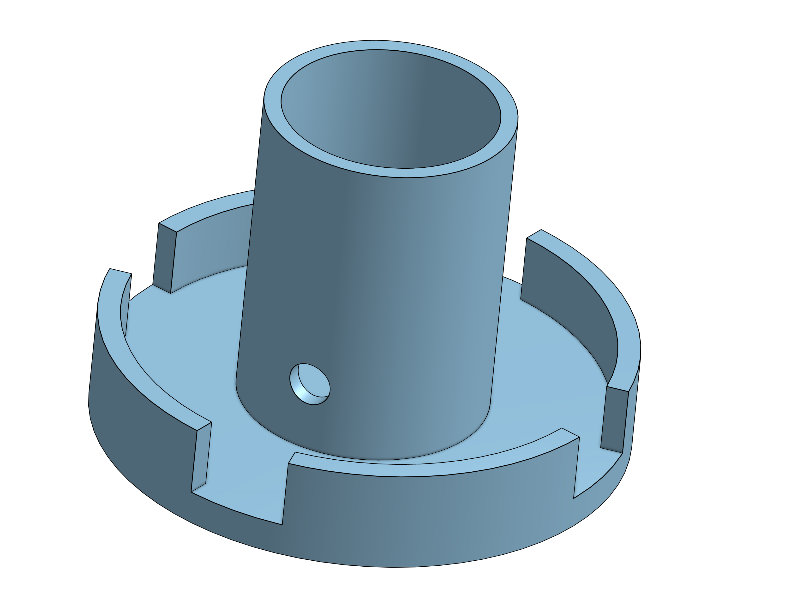

# Hardware

**Updated Components**

Parts printed out for new housing for T-Sat 1 after T-Sat 0 Lauch:

·       Top Panel (refer to figure 1)

·       Parachute Base Mechanism (refer to figure 2)

·       Spare housing for back up and if needed to do testing of different components. Without any interference with the final model. (refer to figure 3)

·       Camera Panel (refer to figure 4&5)

<figure><figcaption>
Figure 1: T-Sat 1 Top Panel
</figcaption></figure>

<figure><figcaption>
Figure 2: T-Sat 1 Parachute Base
</figcaption></figure>

<figure><figcaption>
Figure 3: T-Sat 1 Spare Housing
</figcaption></figure>

With the previous model that was used in T-Sat 0 the battery panel holding system was a press in model secured with tape. As such the mechanical team decided to create a screw in model with four points of union compressed by a back panel and M3 bolts and threaded inserts.&#x20;

<figure><figcaption>
Figure 4: Front of camera panel for T-Sat-1
</figcaption></figure> <figure><figcaption>
Figure 5: Rear of panel 
</figcaption></figure>

With preparation for the flight day a couple of items had to be purchased such as:

·       600 ft tether line

·       Red Rip-Stop Nylon Parachute

·       Physics Weight

 o   To measure the amount of force generated by the tether balloon.

·       25 lb Iron Weight &#x20;

o   To be used as an anchor when with the tether line.

