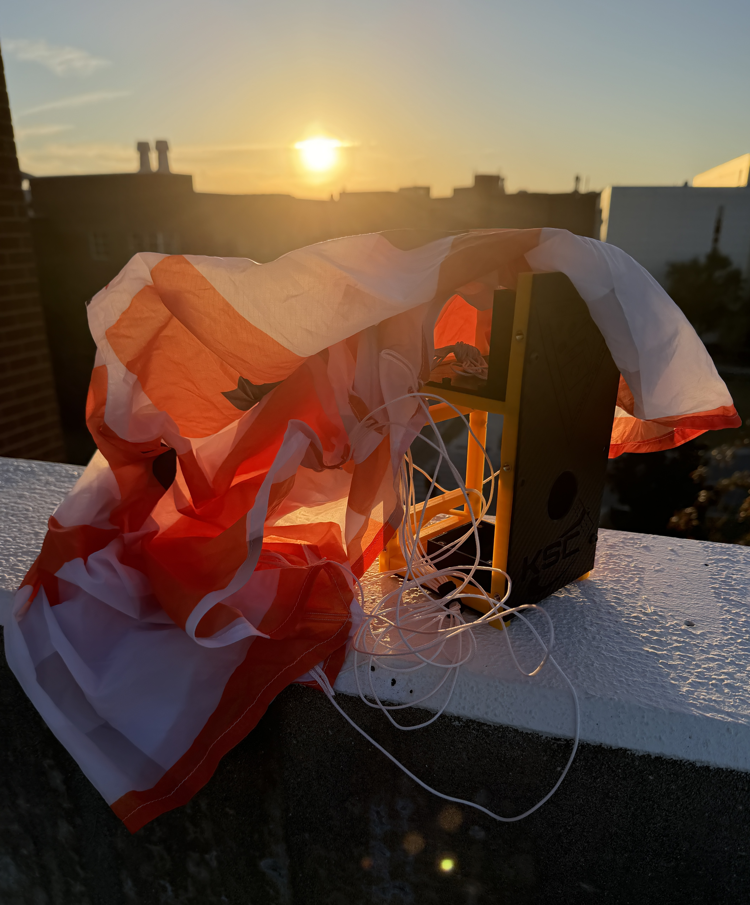

# T-Sat-2 Mission A

Tethered-Sat 2 Mission A (T-Sat 2A) was the second major iteration of the Knights Satellite Club’s Tethered-Sat project, beginning development in Fall 2025 and launching in Spring 2026. Building on the documentation, design practices, and operational experience established during T-Sat-0, T-Sat 2A focused on developing a more integrated and capable 2U platform for hands-on experimentation in satellite systems and balloon-based missions.

The mission was designed to provide students with experience across the full development lifecycle of a small satellite platform, including mechanical design, electronics integration, embedded software, communications, imaging, altitude measurement, data storage, and deployment systems. The project incorporated a modular 3D-printed housing, onboard flight electronics, wireless telemetry, and a remotely controlled separation mechanism to support testing in a real flight environment.

T-Sat 2A also served as a continuation of the club’s rapid development and learning-oriented approach. Members worked through subsystem development, integration, design reviews, and pre-launch testing while gaining practical experience in system-level engineering. The project provided opportunities for students to contribute to individual subsystems while also developing an understanding of how mechanical, electrical, and software components must operate together as a complete mission system.

In addition to its educational purpose, T-Sat 2A supported the Knights Satellite Club’s broader research and development strategy. The platform was used to evaluate design approaches, test integrated subsystems, and identify improvements for future T-Sat missions and larger club projects. Lessons from the mission’s development and flight operations would contribute to future improvements in mechanical reliability, deployment systems, testing procedures, and mission readiness.

<figure><figcaption>
Sunset View with T-Sat 2A
</figcaption></figure>
