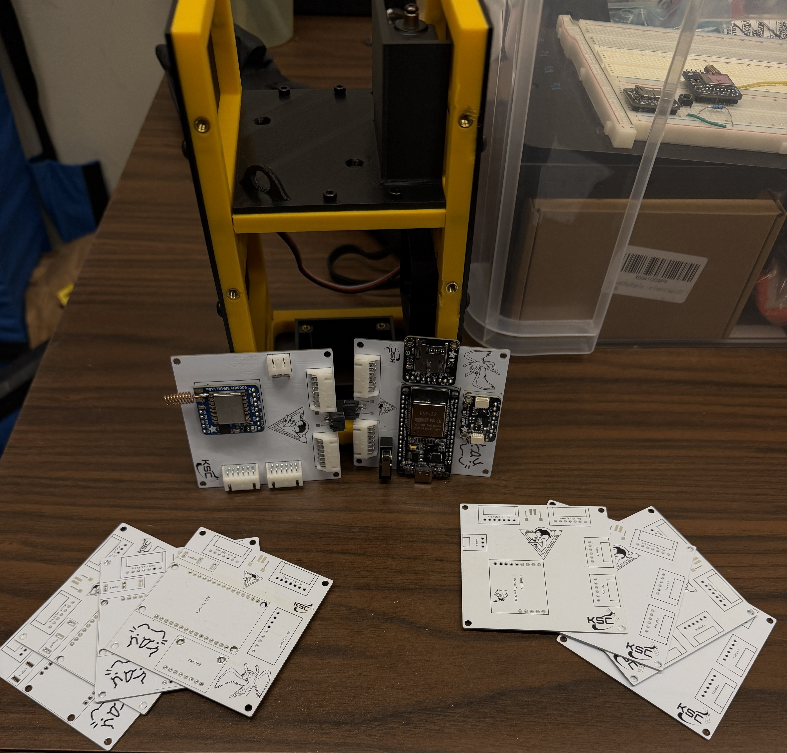

# Electronics

#### Electrical Architecture

The avionics system used two PCBs to distribute power and support the flight computer, sensors, cameras, data storage, radio communication, and separation mechanism. The system was designed to allow the major subsystems to operate within the limited internal space of the 2U housing.

The final configuration included an ESP32-based flight computer, two Arducam cameras, a BMP388 altitude sensor, an SD card, an RFM95W LoRa radio, and a servo-controlled separation system.

<figure><figcaption>
T-Sat 2A Electronics PCB
</figcaption></figure>

#### PCB Development

The PCB design was revised throughout development to resolve integration and power-related issues. Changes included modifications to the SPI bus used by the SD card, removal of the power converter, and removal of the pull-to-launch switch.

The final PCB arrangement was designed to fit within the modular housing while maintaining access to the required electrical connections and mounting points.

<figure><figcaption>
T-Sat 2A Connectors PCB
</figcaption></figure>

#### Power System

The system used separate batteries for the main electronics and the servo mechanism. The final configuration included a 420 mAh battery for the main electronics and a 500 mAh battery for the servo system.

Power output and battery condition were identified as important areas for verification before launch. Future missions should verify battery performance under the expected operating load and confirm that all power connections remain secure after final assembly.

#### Imaging and Data Storage

The imaging system used two cameras to capture flight data. Images and altitude information were stored locally on an SD card, allowing mission data to be recovered even when radio communication was not continuous.

Following recovery, the SD card remained usable and contained image and altitude data from the flight.

#### Altitude and Communication

The BMP388 sensor was used to collect altitude data, while the RFM95W LoRa radio provided wireless communication with the ground station. The flight system supported remote commands, including the `Detach` command used to initiate the separation mechanism.

The system provided command acknowledgement, but the mission demonstrated the importance of distinguishing between a received command and confirmation that the physical mechanism completed the requested action.

<figure><figcaption>
Semi-Assembled PCB Stack
</figcaption></figure>

#### Final Electrical Configuration

The final T-Sat 2A electrical configuration consisted of two custom PCBs, an ESP32 flight computer, two Arducam cameras, a BMP388 barometric altimeter, an RFM95W LoRa radio module, an SD card module, and a servo-controlled separation system.

The primary component functions were as follows:

<table data-header-hidden data-search="false"><thead><tr><th></th><th></th></tr></thead><tbody><tr><td>Component</td><td>Function</td></tr><tr><td>ESP32</td><td>Flight computer and subsystem coordination</td></tr><tr><td>Two Arducam cameras</td><td>Image acquisition</td></tr><tr><td>BMP388</td><td>Barometric altitude measurement</td></tr><tr><td>RFM95W LoRa module</td><td>Wireless communication</td></tr><tr><td>SD card module</td><td>Local image and altitude data storage</td></tr><tr><td>Servo</td><td>Separation mechanism actuation</td></tr><tr><td>Two custom PCBs</td><td>Electrical distribution and subsystem interconnection</td></tr><tr><td>Two lithium-ion batteries</td><td>Separate power sources for the servo and main electronics</td></tr></tbody></table>

The cameras and LoRa module were assigned to the primary SPI bus, while the SD card module used a separate SPI bus. Standardized JST connectors were used for subsystem interconnection, and the final power configuration relied on direct battery connections following the converter-related testing.

The completed electrical system provided the interfaces required for imaging, altitude measurement, telemetry, data storage, and separation. Its final configuration was the result of multiple development iterations addressing power-system performance, PCB development challenges, communication-bus reliability, and control-system integration.
