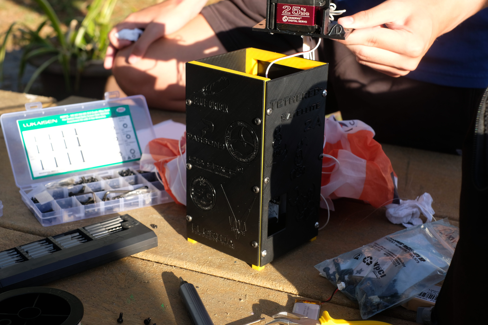
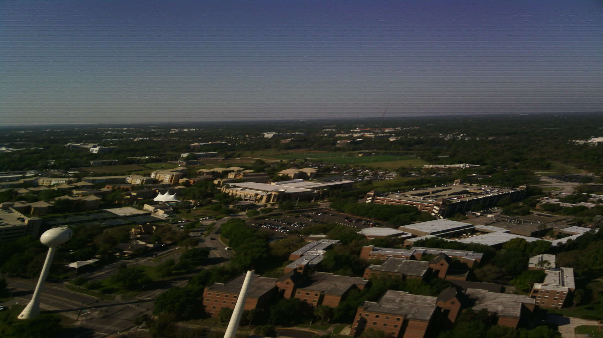
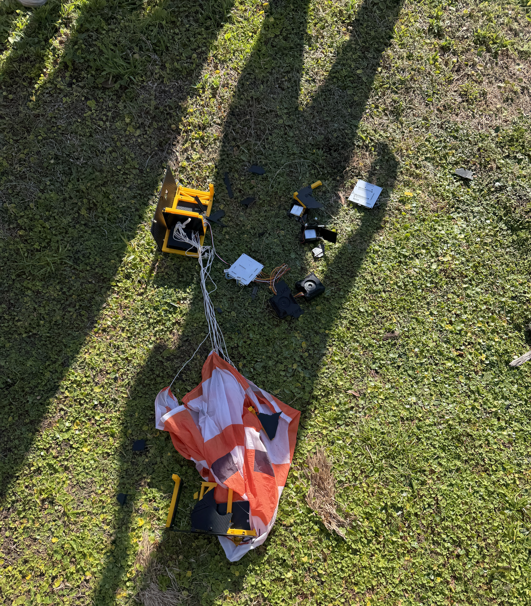
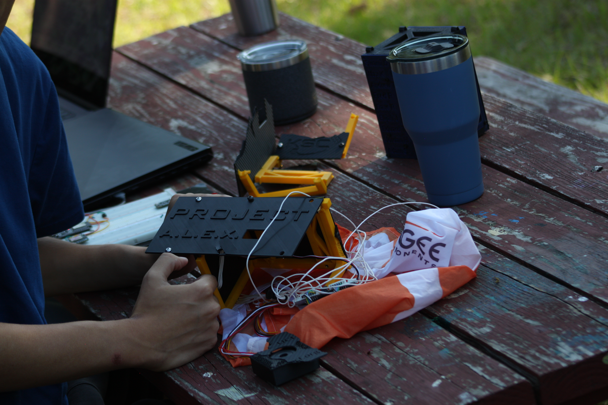
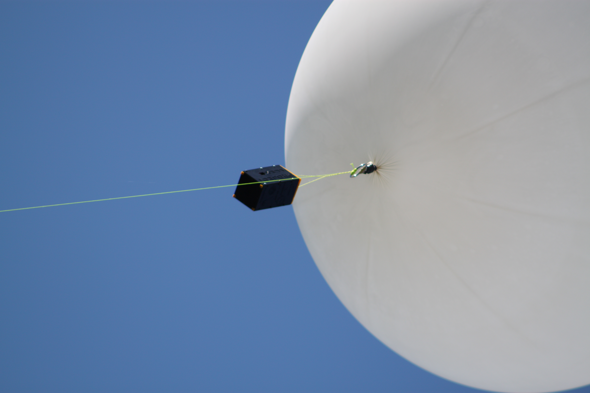

# Flight Results

<figure><figcaption></figcaption></figure>

#### Launch Configuration

Final assembly integrated the mechanical housing, PCBs, batteries, cameras, sensors, radio, servo mechanism, parachute, and external launch equipment. A servo panel was replaced shortly before launch, and additional printed material was present near the separation system.

These late modifications reduced the time available for complete end-to-end testing and final configuration inspection.

#### Important Final Assembly Issues

The final configuration required additional verification of the replacement servo panel, battery output, electrical connections, and parachute exit path. Printed material near the servo and parachute path may have interfered with parachute deployment, although this was not conclusively confirmed.

Future teams should freeze the final configuration early enough to test all replacement parts and modifications as part of the complete system. The parachute should be installed during final deployment testing, and the entire exit path should be inspected for potential interference. External launch equipment, including the rope-reeling system, should also be tested before flight.

### Launch Operations

#### Ascent

The launch system experienced an issue with the rope-reeling equipment, requiring manual intervention during operations. The payload reached an altitude of approximately 450 ft before the separation sequence was completed.

The launch demonstrated the importance of testing external support equipment and preparing contingency procedures before flight.

<figure><figcaption>
Image Captured by T-Sat 2A
</figcaption></figure>

#### Separation

The separation command was successfully received, but the servo did not initially cut the fishing wire. After intervention, the CubeSat eventually separated from the balloon assembly.

The separation system therefore demonstrated partial success: communication and command processing operated as intended, but the initial mechanical deployment did not occur as planned.

### Recovery and Mission Results

#### Parachute Deployment

The parachute did not deploy correctly and remained partially inside the housing. The suspected interference from printed material highlights the need to inspect the complete parachute exit path, including the parachute itself, after all components have been installed in their final flight configuration.

The deployment system should be tested using the final hardware, parachute packing method, component alignment, and mounting configuration.

#### Recovery

The recovered housing sustained significant damage during the flight and landing sequence. However, both cameras remained undamaged, the two PCBs appeared intact, and the SD card was recovered with image and altitude data. Some components had become disconnected, while the Project A.L.E.X. panel remained undamaged.

The recovered hardware and data provided useful information for evaluating the performance of the mechanical structure, avionics, imaging system, and data storage system.

<figure><figcaption>
Images After the T-Sat 2A Crash
</figcaption></figure>

<figure><figcaption></figcaption></figure>

#### Lessons Learned

T-Sat 2 Mission A demonstrated the importance of complete system-level testing and final configuration control. Future teams should prioritize the following:

* Perform end-to-end separation and parachute deployment testing using final flight hardware.
* Inspect the entire parachute exit path with the parachute installed.
* Verify all replacement parts, printed features, and mechanical clearances before launch.
* Freeze the final design early enough to allow sufficient testing.
* Test external launch equipment and prepare contingency procedures.
* Use physical or sensor-based verification for critical actions instead of relying only on software acknowledgements.
* Secure and inspect electrical connections following final assembly and vibration or handling tests.

#### Conclusion

T-Sat 2 Mission A established a foundation for future T-Sat development by demonstrating the integration of a modular 2U housing, onboard avionics, imaging, altitude sensing, data storage, wireless communication, and a remotely controlled separation system. Although the parachute deployment and initial separation attempt were unsuccessful, the recovery of mission data and several functional components provided valuable engineering feedback.

Future missions can build on this work by improving final configuration control, performing more complete deployment testing, strengthening mechanical interfaces, and adding verification methods for critical flight actions. The lessons from Mission A should be used to improve reliability while maintaining the modular and repeatable design approach established during development.

<figure><figcaption>
T-Sat 2A During Flight
</figcaption></figure>
