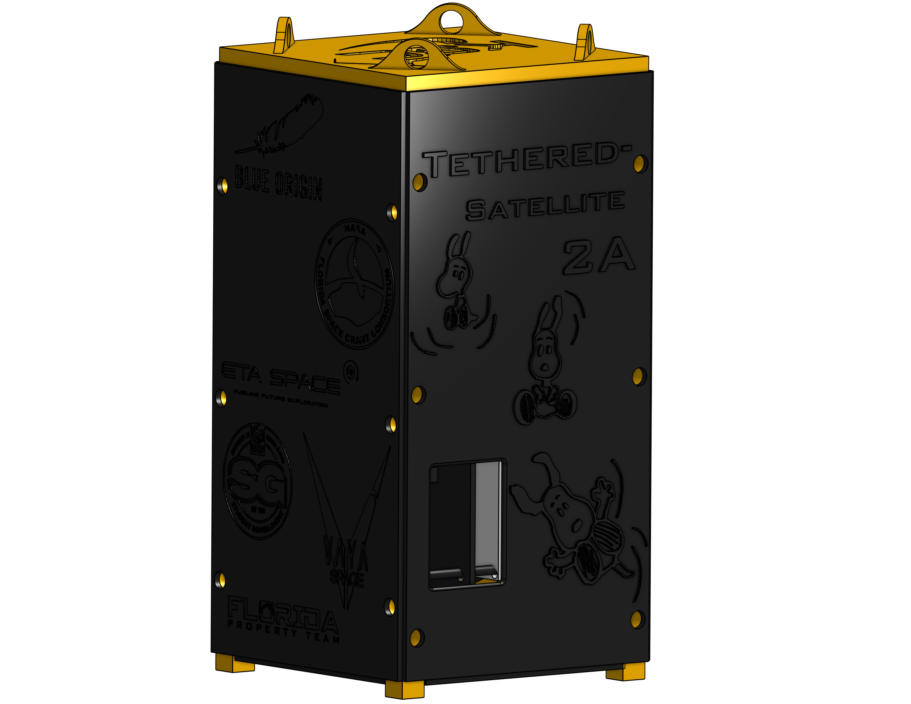
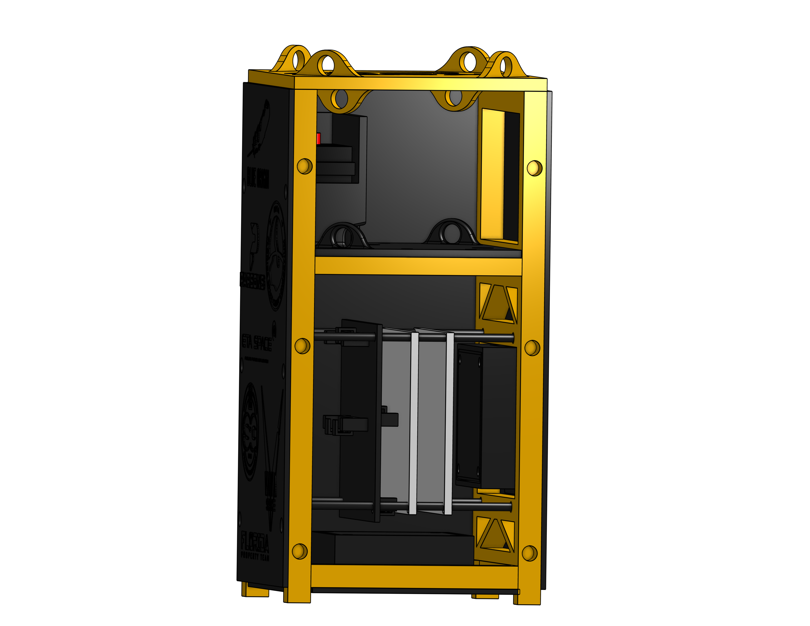
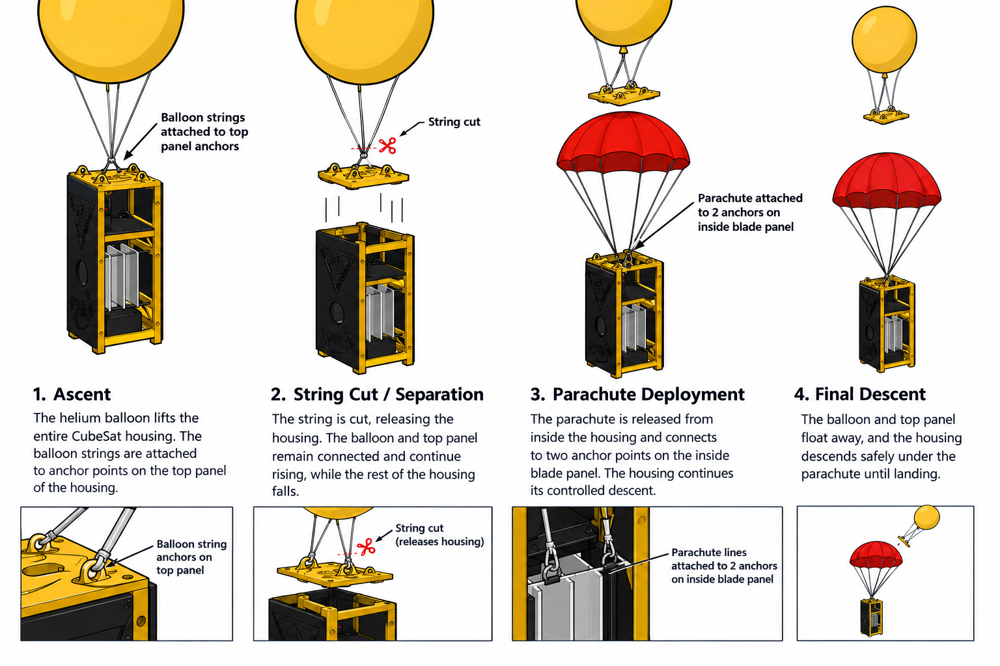

# Hardware

#### Mechanical Development

The T-Sat 2 housing was designed as a modular 2U structure to support rapid design changes, repeatable manufacturing, and simplified subsystem integration. The housing was developed in Onshape and manufactured using 3D-printed PETG components. Heated inserts and standoff-based mounting were used to secure internal PCBs, batteries, and other components while allowing adjustments during testing.

The design incorporated duplicated and reversed housing sections, triangular support features, and open regions to reduce material usage while maintaining structural support. The modular approach allowed components to be removed or repositioned as the electrical and mechanical systems evolved.

<figure><figcaption>
Isometric view of T-Sat 2A
</figcaption></figure>

#### Camera Mounting

The camera mounting system was modified to improve structural support and reduce stress concentrations. Larger fillets were incorporated into the design to improve durability, and the mount was integrated into the housing to maintain camera alignment during flight.

#### Separation Mechanism

The separation system used a servo-actuated blade to cut the fishing wire securing the CubeSat to the balloon and parachute assembly. The mechanism was designed around a four-point fishing-wire connection and approximately 90 degrees of servo rotation.

Although the separation command was received during flight, the initial cutting attempt was unsuccessful. The CubeSat eventually separated after additional intervention, demonstrating that command reception does not necessarily confirm successful physical deployment.

<figure><figcaption>
Interior View of T-Sat 2A
</figcaption></figure>

#### Parachute System

The parachute was designed to deploy through an opening in the housing after separation. Drop testing was performed to evaluate the deployment process; however, the final flight configuration experienced a parachute deployment failure.

The parachute remained inside the housing and only partially exited. Printed material located near the servo and parachute path is considered a suspected source of interference, although the exact root cause was not conclusively confirmed.

<figure><figcaption>
Full Flight Breakdown of T-Sat 2A
</figcaption></figure>
