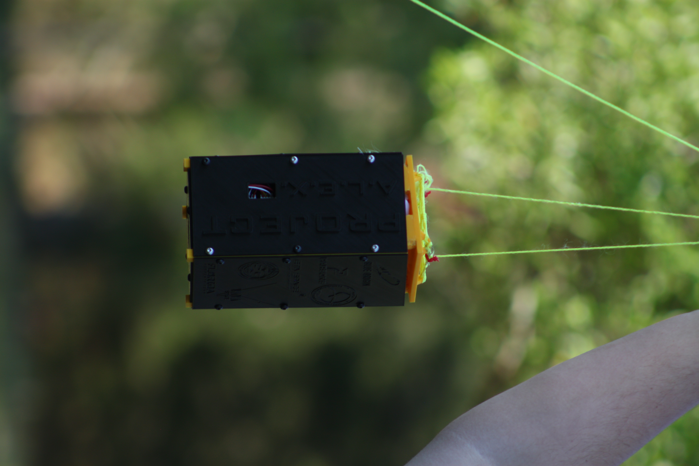

# System Overview

T-Sat 2A was designed around a 2U CubeSat-style architecture, providing approximately twice the internal volume of previous Tethered-Satellite configurations. The additional volume allowed the team to integrate two cameras, an altitude sensor, onboard storage, a LoRa communication system, a flight computer, and a servo-controlled release mechanism.

The mission was designed to operate at an altitude of approximately 500 ft while remaining physically connected to the ground through a tether. A 600 g weather balloon filled with helium provided the lifting force for the system. These operational conditions established the basic requirements for the structure, communication system, release mechanism, and recovery system.

Several descent concepts were considered during the early stages of development. One of the more ambitious concepts involved a self-controlling parafoil capable of autonomous or manual control during descent. This concept was removed from the final T-Sat 2A design because the project was being developed within a one-semester timeline. The final design instead used a simplified parachute system and a remotely actuated separation mechanism.

The final descent system consisted of a 36-inch nylon parachute and a servo-actuated release mechanism. The servo was controlled remotely from the ground station and rotated approximately 90 degrees to actuate a cutting blade. The blade was intended to cut the fishing-wire connection between the upper panel and the main CubeSat housing. This configuration allowed the launch team to initiate separation during flight rather than relying exclusively on an automatic release sequence.

The onboard flight computer was an ESP32 microcontroller. The system incorporated two Arducam cameras, a BMP388 barometric altimeter, an SD card module, an RFM95W LoRa radio module, and a servo used for the separation mechanism. The electrical system was divided between two custom printed circuit boards (PCBs), which were connected using JST connectors and mounted within the housing.

The CubeSat used two separate lithium-ion batteries. A 500 mAh battery was dedicated to the servo system, while a 420 mAh battery powered the primary electronics. This separation was intended to reduce the possibility of servo operation affecting the power available to the flight computer, cameras, sensor, and communication system.

The ground station consisted of an ESP32, an RFM95W LoRa radio module, and a user-operated pushbutton. The ground station was connected to a laptop through USB power and was used to monitor telemetry and transmit the deployment command. The onboard system transmitted altitude information and could receive the command used to initiate the separation sequence.

<figure><figcaption>
Flight Ready T-Sat 2A
</figcaption></figure>

### Supporting Documentation

The following documents provide additional information regarding the T-Sat 2A design, development, testing, launch preparation, flight operations, and postflight assessment.

* **T-Sat 2A Mission Concept Review (MCR)** — Documents the original mission concept, objectives, and initial system design intent.
* **T-Sat 2A Critical Design Review (CDR)** — Documents the final system architecture, mechanical design, electrical development, flight software, budget, and engineering decisions leading to the completed vehicle.
* **T-Sat 2A Flight Readiness Review (FRR)** — Documents final launch preparation, launch-day operations, flight performance, separation behavior, parachute deployment, recovery, mission results, and lessons learned.
* **T-Sat 2A Project Repository** — Contains applicable source code, CAD files, PCB designs, hardware documentation, and project development files. ([Francesca Alfaro GitHub](https://github.com/ColdBloodV/KSC/tree/main/TSAT2-A) / [Seth Jones Github](https://github.com/SethJonesIntern/TSAT))
* **T-Sat 2A STL Models** — Contains all the STL models for the whole 2U CubeSat housing.










