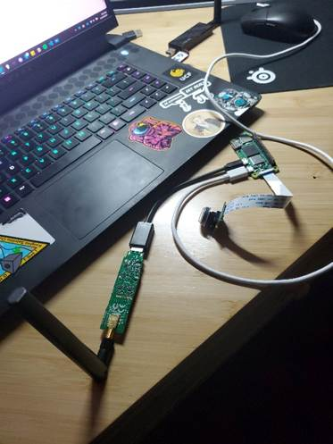
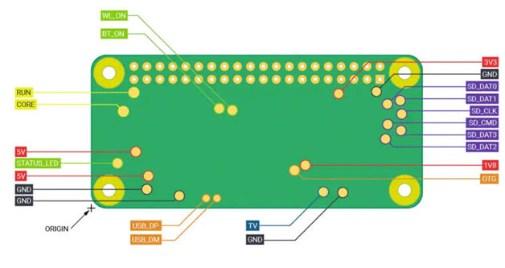

# OpenHD

To preface, I'll first explain how regular wifi works and then explain how OpenHD works.

When you use Wi-Fi on a device, your device is constantly receiving packages of data from the Wi-Fi modem. These packages hold the data needed to refresh pages, work applications, etc...

This process has 4 steps:

1. The modem sends the packages to your device
2. Your device receives/does not receive the package
3. Your device sends a signal back to the modem verifying that the package was received.
4. If the package was not received, the modem sends the package again and continues with other packages.

This process works well for devices like phones and laptops, where you need everything to be loaded properly. It is a connection-focused system that ensures you receive all of the packages that you need to run your application. For example, when running a website, package loss could mean that the website won't load properly or, in extreme cases, won't load at all.

In a system like live video, where it is more important to get the current frame rather than the frame that we should have gotten 2 seconds ago, it's more important to prioritize receiving current data rather than receiving all data. This is where OpenHD comes in.

OpenHD puts Wi-Fi into a state where the modem sends data regardless of verification. This significantly reduces latency in data transfer but also makes the stream of data you receive less reliable, where if you lose connection, all packages will be lost, and you will not be able to get any data.

In the end, OpenHD was selected because it allows reliable video transfer over long distances and is an easy software to use.

The Ground Unit:

Setting up the ground unit for this system was the easiest part, but it still had its learning curve. We decided to use a laptop with SecureBoot turned off to run the OpenHD Desktop software without needing a separate Pi and screen for it. After booting OpenHD on the laptop, we are greeted with a Desktop with all of the options that OpenHD provides, two of which are the ones we used: "OpenHDGroundUnit" and "OpenHD." To get everything set up, we first had to boot up the Ground Unit and then open the main OpenHD UI.

In the main UI, we are greeted with a black screen until the Air Unit automatically connects to it, which then shows the video that the camera is capturing. To get the best results out of the system, before every field test and the final flight, we scanned the networks where the Ground unit and the Air unit are connected. We do this so we can use the channels that are least polluted in the area. So, it is advised to do this process right after the Ground and Air connect.

The main UI also gives many other options in terms of customization. For TSat-2B, most customizations were cosmetic changes, which included hiding some of the pre-set widgets and changing the colors of the UI theme. The other option we changed to better fit our system was the Ground Unit power intake, which helped lessen the overall package loss of the video. This option was the main contributor to how long the system would last on a single battery and how reliable the system was. On lower settings, we would consume less power but wouldn’t be able to move as far away from the ground unit.

For our system, we found that having the power of the Ground unit set on “Max 2” and the power of the Air unit set on “Medium” gave it a good balance between flight time and package loss (These settings will change depending on your system).

The Air Unit:

Since it was our first time using OpenHD, we decided to use regular cables to connect everything at first, just to see how the system functioned and if the Raspberry Pi turned on. We had the battery connected to a buck converter, which would supply power to the Pi and all of its constituents. On the Pi, we connected the WIFI adapter using a USB to Micro-USC adapter, and the camera. During the first boot-up, OpenHD usually takes a bit longer to boot and connect to the ground unit.

Our first boot-up went well. Everything was connected, and we were getting live video from the Air unit perfectly. However, a few tests later, our live video stopped working for some reason. At first, we thought it was because the system wasn't soldered together, but later on, we found out that it was because the copper connections in our camera wire were damaged from the mechanical stress of too much plugging and unplugging of the camera and the Pi. For future iterations, we advise that if it is not necessary to disconnect fragile cables, such as a camera cable, leave those connections connected. That way, the wires don’t end up damaged over the course of the project.

&#x20;The image below showa the Air unit during one of the early tests:

After troubleshooting the camera, we started soldering everything together. While OpenHD recommends soldering every component together. However, we decided that since this was our first time using software, and we did not want to ruin our components, we would solder the USB-to-Micro-USB adapter to the Pi and connect the WIFI adapter through the USB port. We cut the wire of the USB-to-Micro-USB adapter close to the Micro-USB head so that we had as much cushioning as possible in case we needed to cut some more wire.&#x20;

The picture below was taken from the OpenHD website and is the diagram we used to wire the Air unit.

&#x20;.jpeg>)

Below is&#x20;

a picture of the diagram of the back connections of the Pi.

<figure><figcaption></figcaption></figure>

When we stripped the wires of the USB-to-Micro-USB adapter, we followed the Pi diagram to solder the Data+ wire to Data+ connector, Data- wire to Data- connector, Ground to Ground, and %v to the 5V. The reason this is advised is that the Pi itself can’t provide enough power to the WIFI adapter through the Micro-USB port, so soldering it to the 5V connector at the back of the Pi is the best way to bypass this issue. It is also recommended to have a separate battery for the WIFI adapter to properly power it, but for the purposes of T-Sat2B, we decided to have a large battery power both components, but this choice gave us a flight limit of around 32 minutes.

For more information about the wiring, check out the “Wiring” section on the OpenHD website.

More information about OpenHD can be found here: [https://openhdfpv.org/](https://openhdfpv.org/)
