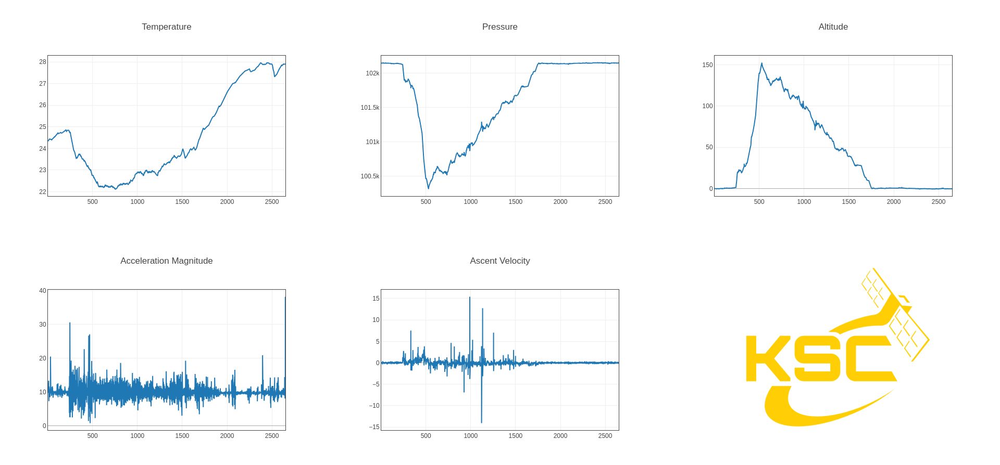

# Results

T-Sat-2B took flight from the UCF arboretum on March 28th, 2026. From start to finish, the flight lasted about 30 minutes, and the maximum altitude reached was around 450ft. With both live video and live telemetry systems lasting the entire flight duration. The mass of the payload was 512.6 grams, far below the limit of what the balloon could lift.

The following is the full on-board video from T-Sat-2B. This is the video that was captured locally onto an SD card on the satellite itself. This is the live video without any lagging or cuts due to packet loss.



The following is the data received from the satellite during its flight. The satellite had three sensors. A temperature sensor, an accelerometer, and a barometer. Together, these sensors took four measurements: temperature, acceleration, pressure, and altitude. The barometer was used to measure both pressure and altitude.

<figure><figcaption></figcaption></figure>

All measurements are in SI units (i.e., the metric system).

### Points of Interest:

* The flight officially started \~260 seconds (8.7 minutes) after the system was activated.
* The satellite reached peaked altitude at \~550 seconds (9.1 minutes) after the system was activated
* The temperature of the satellite generally decreased as its altitude increased and increased again as the altitude decreased.
* The acceleration and velocity seem to be extremely erratic. This could be due to how high the wind speed was that day.
